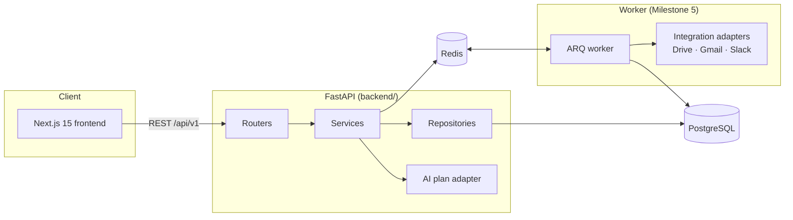

# Dispatch — Architecture

> Living document. Each milestone extends it; decision records live at the
> bottom so the "why" is never lost.

## System overview



**The workflow engine is the product.** The AI layer's only job is to turn a
natural-language request into a strictly-validated JSON plan. Everything that
makes Dispatch trustworthy — approval gates, step lifecycle, retries, audit
logging — is deterministic engineering, not model behavior.

## Layering rules (enforced by convention, checked in review)

```
routers  →  services  →  repositories  →  models
   ↘          ↓
    schemas  core (config, logging)
```

* **Routers** translate HTTP ⇄ domain. No business logic.
* **Services** own business rules and transactions. One responsibility each.
* **Repositories** own persistence. No SQL outside this layer.
* **Core** is imported by everyone and imports from no one above it.

## Execution lifecycle (target design)

```
Workflow (draft) → validate plan → approve → queue → execute steps → complete
```

Step states: `PENDING → RUNNING → SUCCESS | FAILED | SKIPPED | CANCELLED`.
Every transition is persisted (append-only) — the history page is a read
model over that log.

---

## Decision records

### ADR-001 — Monorepo with `frontend/` and `backend/` as siblings
One product, two runtimes. A monorepo keeps API contract changes, docs, and
CI in one reviewable place; separate top-level folders keep toolchains
(npm vs pip) fully isolated. Shared, generated artifacts (e.g. OpenAPI types)
will live in `shared/`.

### ADR-002 — FastAPI app factory (`create_app()`)
A module-level `app = FastAPI()` accumulates import-time side effects and
makes per-test configuration impossible. The factory gives tests a fresh,
isolated app with injected `Settings`, and later lets the worker reuse wiring
without importing server concerns.

### ADR-003 — pydantic-settings for configuration
All configuration is declared, typed, and validated in one module
(`app/core/config.py`). Misconfiguration fails at boot — most valuably, the
app refuses to start in production with the development signing secret.

### ADR-004 — structlog for logging
Execution history must be *searchable* (`execution_id=…`), which requires
key/value logs, not formatted strings. Request IDs are bound via contextvars
once per request and appear on every log line automatically.

### ADR-005 — ARQ for background jobs (decided; implemented in M5)
Celery is the incumbent but is sync-first and heavyweight for this scale.
ARQ is Redis-native and asyncio-native, matching the async SQLAlchemy stack,
with retries, scheduling, and cancellation built in. Tradeoff: smaller
ecosystem — acceptable for a single well-understood queue, and the engine
depends on a thin queue interface so swapping brokers is contained.
